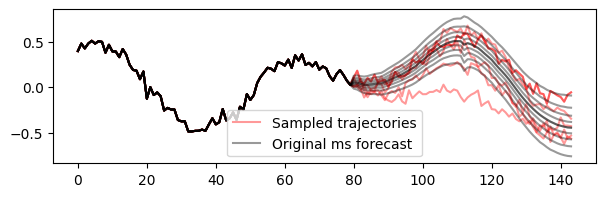
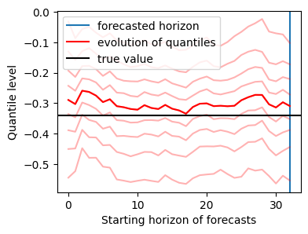

# timesc

This package offers tools to perform NLP-inspired self-consistency for time series forecasting. It applies to any forecasting model.

## Setup

## Usage

### With sampling-based models

### With quantile-based models

Notebook `tirex.ipynb` provides example of usage of quantile based forecasting trajectory sampling, both on synthetic time series datasets and real datasets. Self consistency is then applied to these sampled trajectories, by taking their median.

To sample next step from quantile-based forecast, a pseudo distribution has to be retrieved from the quantiles. `metalog.py` provides a function that outputs inverse cdf based on quantiles. This distribution can be sharpened or smoothened with a temperature parameter. `quantile_sampling.py` provides a function that samples trajectories.

Once trajectories are sampled, new multistep quantile forecasts can be obtained, either based on trajectories themselves, or by intermediate forecasts made along these trajectories.

